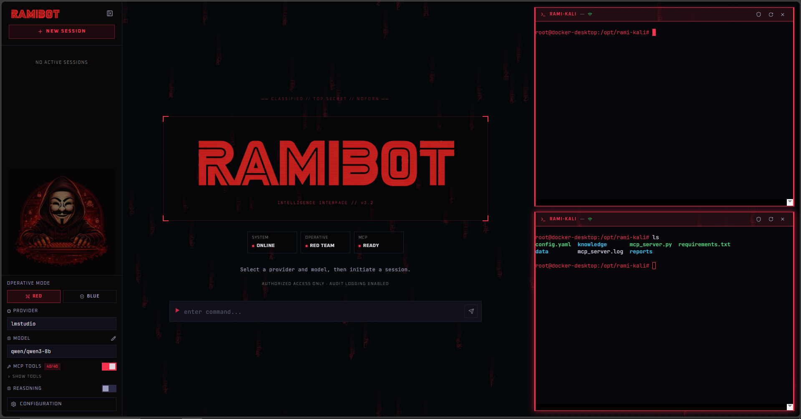

<p align="center">
  
</p>

<h2 align="center">RamiBot — AI Security Operations Platform</h2>

<p align="center">
  <b>Local-first • Red/Blue Team • MCP-Powered • Docker-Integrated</b>
</p>

<p align="center">
  <a href="LICENSE">
    
  </a>
  
  
  
  
  
</p>

---

<p align="center">
  <b>Execute. Analyze. Harden.</b>
</p>


# RamiBot v3.4

A local-first AI chat interface for security operations. Supports multiple LLM providers, real-time streaming, MCP tool integration, a dynamic security skill system, Docker terminal access, Tor transparent proxy management, a persistent findings database, one-click PDF report export, and a human-in-the-loop **Tool Approval Gate** that pauses execution before every MCP tool call until the operator approves or denies it.

<p align="center">
  
</p>

---

## Overview

RamiBot is a self-hosted chat application built for security engineers who need a controllable, extensible interface between LLMs and operational tooling.

It does not depend on any cloud chat product. Conversations are stored locally in SQLite. Provider API keys are configured at runtime. All tool execution happens inside Docker containers.

The core differentiator is the **skill pipeline**: a prompt engineering system that detects the operational context from user input (reconnaissance, exploitation, defense, analysis, reporting), selects the appropriate skill, and injects structured methodology instructions into the system prompt before each LLM call. Team mode (red or blue) controls which skills are available and how the LLM frames its responses.

**Who it is for:**

- Security engineers running structured red team or blue team workflows
- Analysts who need LLM-assisted reasoning alongside real tool execution via MCP
- Researchers integrating local models (Ollama, LM Studio) into security workflows
- Teams that need full local data control with no cloud dependency for conversation history

---

## Architecture

```
┌─────────────────────────────────────────────────────────────────┐
│                         FRONTEND (React 19)                     │
│  Sidebar  │  ChatPanel  │  SettingsModal  │  DockerTerminal     │
│                    Zustand State Store                          │
│           SSE consumer / fetch client (port 5173)               │
└───────────────────────────┬─────────────────────────────────────┘
                            │ HTTP / SSE
┌───────────────────────────▼─────────────────────────────────────┐
│                      BACKEND (FastAPI)                          │
│                                                                 │
│  /api/chat/stream ──► SkillPipeline ──► LLM Adapter             │
│                             │                    │              │
│                      PromptComposer       httpx (SSE)           │
│                             │                    │              │
│                      System Prompt        Provider API          │
│                                                                 │
│  Tool call detected ──► MCPClient ──► rami-kali MCP server      │
│                     (auto-configured)   (docker exec stdio)     │
│                                    ──► MCP Server (stdio/HTTP)  │
│  Tool result ──────────────────────► LLM follow-up              │
│                                                                 │
│  /api/terminal/* ──► TerminalSession ──► docker exec            │
│  /api/docker/tor ──► tor_start/stop  ──► iptables (container)   │
│                                                                 │
│  aiosqlite ──► ramibot.db                                       │
│  settings.json ──► provider credentials + docker config         │
└─────────────────────────────────────────────────────────────────┘
```

**Data flow for a streaming chat request:**

1. Frontend sends `POST /api/chat/stream` with conversation ID, provider, model, team mode, MCP flag, and optional `require_tool_approval`
2. Backend loads conversation history from SQLite
3. If MCP is enabled: skill pipeline classifies the input, selects a skill, builds a system prompt, and injects it as the first message in history
4. Adapter streams the LLM response as Server-Sent Events (token events)
5. If the LLM emits a tool call and **Approval Mode** is on: backend yields a `tool_approval_required` SSE event and waits (up to 120 s) for the operator's decision via `POST /api/chat/approve`; auto-denies on timeout
6. If approved (or Approval Mode is off): the MCP client executes the tool, the result is appended to history, and a follow-up generation is triggered
7. Backend saves the final message to SQLite with token usage and latency
8. Frontend renders tokens incrementally and tool traces in real time

---

## Skill System

The skill system is invoked on every MCP-enabled chat request. It classifies input, selects a skill, and builds a structured system prompt tailored to the operation phase and team mode.

### Components

| Component | File | Responsibility |
|-----------|------|----------------|
| `SkillPipeline` | `skills/pipeline.py` | Orchestrates the full build-prompt flow |
| `InputClassifier` | `skills/classifier.py` | Regex and substring trigger matching |
| `PromptComposer` | `skills/composer.py` | Assembles system prompt from selected skill |
| `SkillRegistry` | `skills/registry.py` | Loads skill definitions from JSON |

### Skill Definitions

| Skill | Teams | Priority | Risk | Trigger examples |
|-------|-------|----------|------|------------------|
| `recon` | red, blue | 10 | low | scan, nmap, enumerate, port, subdomain, dns |
| `exploit` | red only | 20 | high | exploit, payload, shell, rce, xss, sqli, privesc, metasploit |
| `defense` | blue only | 20 | low | harden, firewall, patch, mitigate, incident, siem, ids |
| `analysis` | red, blue | 30 | low | analyze, log, traffic, pcap, forensic, anomaly, wireshark |
| `reporting` | red, blue | 50 | low | report, document, executive, findings, export |

### Pipeline Logic

1. **Trigger classification**: Word-boundary regex matches user input against skill trigger lists
2. **Phase inference**: If no triggers match, the last 3 messages are scanned for phase markers (`[RECON]`, `payload`, `patch`, etc.)
3. **Dominant skill selection**: Highest-priority match wins. `reporting` is suppressed if `exploit` or `defense` is also matched.
4. **Fallback**: No match defaults to the team default (recon for red, analysis for blue)
5. **Context extraction**: IPv4, URL, and `host:port` patterns are extracted from input and recent history and injected as `CONTEXT TARGET` in the prompt
6. **Execution intent**: Imperative verbs ("run", "execute", "scan", "exploit") are detected and signaled to the composer
7. **Prompt assembly**: Team preamble + skill methodology section + common footer (MCP guidance, language matching, no fabrication rule)
8. **Audit log**: Every decision is appended as JSON to `skill_decisions.log`

### Team Modes

**Red (`team_mode: "red"`)**
- Preamble: authorized engagement, attacker perspective, tool-first
- Active skills: recon, exploit, analysis, reporting
- Priority order: exploit > recon > analysis > reporting

**Blue (`team_mode: "blue"`)**
- Preamble: incident responder, remediation-driven
- Active skills: defense, analysis, reporting, recon
- Priority order: defense > analysis > reporting > recon

Team mode is selected per conversation from the sidebar toggle and persisted in localStorage.

---

## LLM Integration

All providers implement a common `BaseAdapter` interface:

```python
async def capabilities() -> dict
async def list_models() -> list[dict]
async def generate(messages, model, **kwargs) -> dict
async def stream(messages, model, **kwargs) -> AsyncGenerator[dict, None]
```

Streaming events emitted by all adapters:

| Event | Payload |
|-------|---------|
| `token` | `{"data": "<text>"}` |
| `tool_call` | `{"data": {"id", "name", "arguments"}}` |
| `usage` | `{"data": {"prompt_tokens", "completion_tokens", "total_tokens"}}` |
| `done` | `{"data": None}` |

### Supported Providers

**OpenAI**
- Endpoint: `https://api.openai.com/v1` (configurable base URL)
- Models: fetched dynamically from `/v1/models`
- Tool calling: yes (OpenAI format)
- Reasoning: yes (o1/o3/o4 series via `reasoning_effort`)
- Streaming: yes, with `stream_options: include_usage`

**Anthropic**
- Endpoint: `https://api.anthropic.com/v1`
- Models: fetched dynamically from `/v1/models` (requires API key)
- Tool calling: yes (tool_use blocks; input schema sanitized to remove oneOf/anyOf/allOf)
- Reasoning: yes (extended thinking via `thinking.budget_tokens`)
- Streaming: yes (Anthropic SSE event protocol)

**OpenRouter**
- Endpoint: `https://openrouter.ai/api/v1` (configurable)
- Models: fetched dynamically from OpenRouter API
- Tool calling: yes (OpenAI-compatible)
- Reasoning: no

**LM Studio**
- Endpoint: configurable (default `http://localhost:1234/v1`)
- Models: fetched from local LM Studio instance
- Tool calling: yes (accumulated across stream chunks)
- Reasoning: yes (filters `<think>...</think>` blocks; appends `/no_think` suffix when disabled)
- Timeout: 300s

**Ollama**
- Endpoint: configurable (default `http://localhost:11434`)
- Models: fetched from local Ollama instance
- Tool calling: no
- Reasoning: no
- Token counts: from `eval_count` / `prompt_eval_count`

### Context Handling

- Full conversation history is sent on every request (no summarization or windowing)
- System prompt from the skill pipeline is injected as the first history entry
- After a tool call: the assistant message with `tool_calls` and the tool result messages are appended before the follow-up generation
- Token usage and latency are stored per message in SQLite

---

## MCP Integration

RamiBot implements the Model Context Protocol client for connecting external tool servers.

### Connection Types

- **stdio**: Spawns a local subprocess and communicates via JSON-RPC 2.0 over stdin/stdout. Uses a background reader thread (compatible with Windows selector loop limitation).
- **HTTP**: POST requests to a remote MCP server URL.

### Tool Namespacing

All tools are prefixed: `{server_name}__{tool_name}`. This allows multiple MCP servers to coexist without name collisions. The prefix is stripped before the server call.

### Persistence

MCP server configurations are stored in the SQLite `mcp_servers` table. On startup, all saved servers are automatically reconnected.

### Schema Normalization

Tool schemas are wrapped in `{"type": "function", "function": {...}}` format for OpenAI-style tool calling compatibility across all adapters.

### Disabling Tools

Individual tools can be disabled per session from the Settings modal. Disabled names are sent in `ChatRequest.disabled_tools` and filtered before injection into the LLM context.

---

## Rami-Kali MCP Server

RamiBot ships with a pre-integrated red team toolserver built on Kali Linux and delivered as a Docker container (`rami-kali/`).

### Overview

- **41+ pentest tools** available as MCP tools, callable by the LLM during any MCP-enabled session
- **Auto-connection**: on first backend startup, RamiBot seeds the `rami-kali` MCP server entry automatically — no manual configuration required
- **Transport**: stdio via `docker exec -i rami-kali python3 /opt/rami-kali/mcp_server.py`
- **Scope enforcement**: `config.yaml` inside the container defines allowed target ranges; the server rejects out-of-scope calls
- **Evidence gate**: tool output is only forwarded to the LLM after a scope check passes
- **Audit log**: every tool call is appended to an internal audit trail

### Tool Categories

| Category | Example tools |
|----------|---------------|
| Recon | nmap, masscan, whois, theHarvester, amass, subfinder, dnsx |
| Web | nikto, gobuster, ffuf, sqlmap, whatweb, wafw00f |
| Exploit | metasploit-framework, searchsploit, msfvenom |
| Credential | hydra, medusa, hashcat, john, crackmapexec |
| SMB / AD | enum4linux, smbclient, bloodhound, impacket suite |
| Wireless | aircrack-ng, reaver, hcxtools |
| Social eng | gophish, setoolkit |

### Knowledge Base

`rami-kali/knowledge/` contains 27 structured Markdown files used by the MCP server to prepend tactical context to tool results. Categories include: tool usage guides, MITRE ATT&CK mappings, result interpretation guides, and operational checklists.

### Quick Start

```bash
# Build the image (one-time)
make rami-kali-build

# Start the container
make rami-kali-start

# View logs
make rami-kali-logs

# Stop
make rami-kali-stop
```

On next backend start, `[MCP] Auto-configured rami-kali server 'rami-kali'` will appear in the logs and the server will be listed in Settings > MCP with its full tool set.

---

## Docker Terminal

RamiBot includes a browser-based terminal connected to a Docker container via `docker exec`.

### Platform Behavior

- **Unix**: `pty.openpty()` for full PTY allocation. Supports interactive programs (vim, tmux, etc.), resize events, and full ANSI rendering.
- **Windows**: Pipe-based communication (`docker exec -i`). Uses `script` utility for PTY emulation if available; falls back to plain bash.

### Session Lifecycle

| Step | Endpoint |
|------|----------|
| Create session | `POST /api/terminal/start` |
| Stream output (SSE, base64) | `GET /api/terminal/stream?session_id=X` |
| Send input (base64) | `POST /api/terminal/input` |
| Resize PTY | `POST /api/terminal/resize` |
| Terminate session | `POST /api/terminal/stop` |

Up to 2 concurrent terminal panels can be open simultaneously in the UI.

### Tor Transparent Proxy

When a Docker container has `NET_ADMIN` capability:

- `POST /api/docker/tor {"action": "start"}` installs iptables rules to redirect TCP traffic through Tor TransPort (9040) and DNS through port 5353
- `POST /api/docker/tor {"action": "stop"}` removes the rules and stops the Tor process
- `GET /api/docker/tor` returns `{ running, transparent_proxy, kill_switch }`

Requires a Tor installation inside the container. Intended for use in isolated lab environments only.

---

## Installation

### Requirements

- Python 3.10+
- Node.js 18+
- npm
- Docker (optional, for terminal and Tor features; required for rami-kali MCP server)

### Clone

```bash
git clone <repository-url>
cd ramibot
```

### Backend

```bash
cd backend
python -m venv .venv

# Windows
.venv\Scripts\activate

# macOS / Linux
source .venv/bin/activate

pip install -r requirements.txt
```

### Frontend

```bash
cd frontend
npm install
```


### 🔴 Rami-Kali (Core MCP Tool Server)

Rami-Kali is the official MCP tool server for RamiBot and provides real penetration testing tooling (nmap, metasploit, hydra, etc.).

While RamiBot can run as an AI-only interface, its full operational capability is unlocked when rami-kali is running.

Docker is required for rami-kali.

#### Prerequisite
Docker installed and running.

- Windows / macOS: Docker Desktop
- Linux: Docker Engine


#### 1. Build the image

```bash
# Via Makefile
make rami-kali-build

# Or directly
docker build -t rami-kali rami-kali/
```

The image is based on `kalilinux/kali-rolling` and installs ~60 penetration testing tools. The first build takes several minutes depending on your connection.

#### 2. Start the container

```bash
# Via Makefile
make rami-kali-start

# Or directly
docker compose -f rami-kali/docker-compose.yml up -d
```

#### 3. Verify

```bash
docker ps | grep rami-kali
```

#### 4. Scope configuration

Allowed target ranges are managed from **Settings > Scope** in the UI. Changes are written to `rami-kali/config.yaml` and the container is restarted automatically — no rebuild required.

You can also edit the file directly before starting the container:

```yaml
security:
  require_scope_check: true   # set to false to disable enforcement
  allowed_scope:
    - "192.168.1.0/24"
    - "10.0.0.0/8"
    - "172.16.0.0/12"
```

The MCP server rejects any tool call whose target IP falls outside these ranges.

#### Auto-registration

On the next backend startup, RamiBot detects the running container and registers it as an MCP server automatically:

```
[MCP] Auto-configured rami-kali server 'rami-kali'
```

The server appears in **Settings > MCP** with its full tool list. No manual configuration needed.

#### Container management

```bash
make rami-kali-stop      # stop the container
make rami-kali-logs      # follow logs
make rami-kali-build     # rebuild after changes

docker exec -it rami-kali bash   # open a shell inside
```

---

### Run

**Two terminals:**

```bash
# Terminal 1
cd backend
python -m uvicorn main:app --reload --port 8000

# Terminal 2
cd frontend
npm run dev
```

**Makefile (macOS/Linux):**

```bash
make install
make dev
```

Open `http://localhost:5173`.

---

## Configuration

### Provider Credentials

API keys and base URLs are configured through the Settings modal in the UI and saved to `backend/settings.json`.

| Provider | Field | Default |
|----------|-------|---------|
| OpenAI | `api_key` | — |
| Anthropic | `api_key` | — |
| OpenRouter | `api_key` | — |
| LM Studio | `base_url` | `http://localhost:1234/v1` |
| Ollama | `base_url` | `http://localhost:11434` |

### Docker

Set the container name in Settings > Docker. The container will be started automatically if it is stopped when a terminal session is requested.

### MCP Servers

Add MCP servers from Settings > MCP. Each server requires:

- **Name**: identifier used for tool namespacing
- **Type**: stdio (command + args) or remote (HTTP URL)

Servers are persisted in SQLite and reconnected on backend restart.

> **Note:** The `rami-kali` server is pre-configured automatically on first startup if the `rami-kali` Docker container is running. No manual entry is needed. If the container is not running, the server will appear as disconnected in Settings > MCP and can be reconnected after starting the container with `make rami-kali-start`.

### Scope

Allowed target ranges for the `rami-kali` MCP server are managed from **Settings > Scope**.

- Add or remove CIDR ranges with immediate visual feedback
- Toggle **Enforce Scope Check** to enable or disable enforcement entirely
- Click **SAVE & RESTART** to write `rami-kali/config.yaml` and restart the container in one action

No Docker rebuild is required. The config file is bind-mounted, so the container picks up the new values on restart.

The underlying file (`rami-kali/config.yaml`) can also be edited directly — the UI reads from it on load.

### Skill Log

All skill activation decisions are written to `backend/skill_decisions.log` in newline-delimited JSON. Each entry contains: timestamp, team mode, input snippet, matched triggers, activated skills, risk level, extracted target, prompt length.

```bash
GET  /api/skills/log?limit=50   # retrieve
DELETE /api/skills/log          # clear
```

Also accessible from Settings > Skill Log in the UI.

### Environment Variables

`.env.example` is provided as a reference template:

```bash
OPENAI_API_KEY=
ANTHROPIC_API_KEY=
OPENROUTER_API_KEY=
LMSTUDIO_BASE_URL=http://localhost:1234/v1
OLLAMA_BASE_URL=http://localhost:11434
DATABASE_URL=sqlite:///./ramibot.db
CORS_ORIGINS=http://localhost:5173
```

Note: runtime credentials are read from `backend/settings.json` (written by the UI), not from `.env`. The `.env` file is a reference template.

---

## Usage

### Basic Chat

1. Select a provider and model from the top bar
2. Type a message and press Enter
3. Response streams token by token in real time

### Red Team Session

1. Set team mode to **Red** in the sidebar
2. Enable **MCP** if tool execution is needed
3. Start with a recon prompt:

```
scan 10.10.10.0/24 for open ports and services
```

The pipeline detects the recon context, injects nmap methodology instructions, and routes any `nmap__*` tool calls to the MCP server.

4. Follow up with exploitation:

```
enumerate SMB shares on 10.10.10.15 and check for anonymous access
```

The pipeline transitions to the exploit skill. Tool results from each step are fed back into history for chained reasoning.

### Blue Team Session

1. Set team mode to **Blue**
2. Enable MCP
3. Analyze:

```
analyze these auth.log entries for brute force indicators: [paste logs]
```

The pipeline selects the analysis skill. The LLM returns a structured timeline, IOCs, and mitigations.

4. Remediate:

```
harden SSH configuration on Ubuntu 22.04 to prevent this attack vector
```

The pipeline transitions to the defense skill, returning severity-tagged findings with exact commands.

### MCP Tool Execution

When MCP is enabled and the LLM emits a tool call:

1. The tool call is displayed in real time as a collapsible trace in the chat
2. The MCP client executes the tool against the configured server
3. The result is displayed and injected back into the LLM context
4. The LLM generates a follow-up response interpreting the result

### Tool Approval Gate

When **Approval Mode** is enabled (sidebar toggle, visible only when MCP is active), RamiBot pauses before executing every MCP tool call and waits for explicit operator confirmation.

**Enabling it:**

1. Enable MCP in the sidebar
2. The **Approval Mode** toggle appears — activate it

**What happens on a tool call:**

1. A banner appears inline between the chat and the message input, showing:
   - The tool short name (prefix stripped) and up to 4 key arguments (`target`, `host`, `port`, etc.)
   - A **risk badge** colored by level: `low` (green), `medium` (amber), `high` (orange), `critical` (red) — sourced from `rami-kali/config.yaml → risk_levels`
   - A **countdown timer** from 120 s; turns red at ≤ 15 s
2. Click **APPROVE** → tool executes normally; stream continues
3. Click **DENY** → backend injects `[TOOL EXECUTION DENIED BY USER]` into the LLM context; LLM reports the denial and suggests alternatives
4. **Timeout** (120 s with no response) → auto-denied; banner shows "TIMED OUT — AUTO-DENIED"
5. Pressing **Stop** mid-approval clears the banner immediately

Risk levels are read from `rami-kali/config.yaml → risk_levels`. Tools not listed default to `medium`.

### Findings Database

Tool execution results can be saved as structured security findings for later review and export.

**Saving a finding:**

1. Expand any tool trace in the chat (click the tool name row)
2. Click **SAVE AS FINDING** at the bottom of the trace
3. The modal pre-fills the title (`tool → target`), description (cleaned evidence gate text — no raw JSON), and target from the tool arguments
4. Select severity (Info / Low / Medium / High / Critical) and save

**Reviewing findings:**

Open **Settings > Findings** to see all saved findings. From there you can:

- Filter by severity
- Expand long descriptions inline (▼ SHOW MORE / ▲ SHOW LESS)
- Export the filtered set as **JSON** or **CSV** (respects the active severity filter)
- Export a single finding as JSON or CSV using the per-card buttons
- Delete individual findings

**Description extraction:**

The finding description is auto-populated from the tool's evidence gate — the structured summary block that RamiBot's MCP server prepends to every tool result. This gives clean, human-readable evidence (verified facts, status, finding count) without raw JSON dumps or internal instruction text.

### Reporting and PDF Export

The reporting skill generates structured security reports (executive summary, per-finding analysis, attack path, recommendations, appendix).

After generating a report, the LLM offers PDF export:

> *¿Quieres exportar este reporte como PDF? Escribe **pdf** para descargarlo.*

Type `pdf` (or `sí`, `dale`, `yes`, etc.) — the frontend intercepts the message without making an LLM call, opens a print-ready window, and triggers the browser print dialog automatically.

The PDF includes:
- **RamiBot logo** in the header with generation timestamp
- Full report in clean typography (sans-serif, proper heading hierarchy)
- Severity badges colored by level (`[CRITICAL]`, `[HIGH]`, etc.)
- Formatted tables, code blocks, and lists
- Print-optimized CSS with page-break handling

No additional npm packages are required — PDF generation uses the browser's native print-to-PDF capability via `window.print()`.

### Docker Terminal

1. Configure a container name in Settings > Docker
2. Click the terminal icon in the chat header to open a terminal panel
3. A second panel can be opened (max 2 concurrent)
4. The terminal runs inside the configured container via `docker exec`

---

## API Reference

### Conversations

| Method | Path | Description |
|--------|------|-------------|
| GET | `/api/conversations` | List all conversations |
| POST | `/api/conversations` | Create conversation |
| GET | `/api/conversations/{id}` | Get conversation with messages |
| DELETE | `/api/conversations/{id}` | Delete conversation |
| GET | `/api/conversations/{id}/export?format=json\|markdown` | Export |

### Chat

| Method | Path | Description |
|--------|------|-------------|
| POST | `/api/chat` | Non-streaming chat |
| POST | `/api/chat/stream` | SSE streaming chat with MCP tool execution |
| POST | `/api/chat/approve` | Resolve a pending tool approval (`approval_id`, `approved: bool`) |

### Providers

| Method | Path | Description |
|--------|------|-------------|
| GET | `/api/providers` | List providers and capabilities |
| GET | `/api/models?provider=X` | List models for provider |

### MCP

| Method | Path | Description |
|--------|------|-------------|
| GET | `/api/mcp/servers` | List configured servers |
| POST | `/api/mcp/servers` | Add server |
| DELETE | `/api/mcp/servers/{name}` | Remove server |
| GET | `/api/mcp/all-tools` | All tools across all servers |
| GET | `/api/mcp/tools?server=X` | Tools from specific server |
| POST | `/api/mcp/call` | Execute tool directly |

### Terminal

| Method | Path | Description |
|--------|------|-------------|
| POST | `/api/terminal/start` | Create terminal session |
| GET | `/api/terminal/stream?session_id=X` | SSE output stream |
| POST | `/api/terminal/input` | Send input (base64) |
| POST | `/api/terminal/resize` | Resize PTY |
| POST | `/api/terminal/stop` | Terminate session |

### Scope

| Method | Path | Description |
|--------|------|-------------|
| GET | `/api/scope` | Read `allowed_scope` and `require_scope_check` from `config.yaml` |
| PUT | `/api/scope` | Write scope config and restart the `rami-kali` container |

`PUT /api/scope` body:
```json
{
  "allowed_scope": ["192.168.1.0/24", "10.0.0.0/8"],
  "require_scope_check": true
}
```

### Findings

| Method | Path | Description |
|--------|------|-------------|
| POST | `/api/findings` | Save a new finding |
| GET | `/api/findings?severity=X&conversation_id=Y&limit=N` | List findings (all filters optional) |
| DELETE | `/api/findings/{id}` | Delete a finding |
| GET | `/api/findings/export?format=json\|csv&severity=X&conversation_id=Y` | Export findings as file download |

`POST /api/findings` body:
```json
{
  "conversation_id": "uuid-or-null",
  "tool": "rami-kali__nmap",
  "severity": "high",
  "title": "nmap → 192.168.1.54",
  "description": "status: success\nverified_facts:\n  - 22/tcp open ssh ...",
  "target": "192.168.1.54"
}
```

### Settings

| Method | Path | Description |
|--------|------|-------------|
| GET | `/api/health` | Health check |
| POST | `/api/settings` | Save configuration |

### SSE Event Format (`/api/chat/stream`)

```
event: token
data: {"token": "<text>"}

event: tool_call
data: {"id": "call_xxx", "name": "server__tool", "arguments": "{...}"}

event: tool_result
data: {"tool": "server__tool", "arguments": {...}, "result": {...}}

event: tool_approval_required
data: {"approval_id": "uuid", "tool_name": "server__tool", "arguments": {...}, "risk_level": "high"}

event: clear_content
data: {}

event: usage
data: {"prompt_tokens": 100, "completion_tokens": 200, "total_tokens": 300}

event: done
data: {"token_usage": {...}, "latency_ms": 1840.5}

event: error
data: {"error": "..."}
```

---

## Security Notice

RamiBot is designed for use in authorized, controlled environments.

- No built-in authentication. Do not expose to untrusted networks.
- API keys are stored in plaintext in `backend/settings.json`. Protect this file accordingly.
- The terminal feature executes commands inside Docker containers. Ensure containers are properly isolated from the host and network.
- The Tor feature modifies iptables rules inside containers. It requires NET_ADMIN or privileged mode and is intended for isolated lab use only.
- The skill system generates security-focused LLM prompts. Use only within the scope of authorized engagements or controlled research environments.
- No liability is assumed for use outside of authorized contexts. The user is responsible for compliance with applicable laws and organizational policies.

---


---

## Stack

| Layer | Technology |
|-------|------------|
| Backend framework | FastAPI + Uvicorn |
| Async database | aiosqlite (SQLite 3, WAL mode) |
| HTTP client | httpx |
| Server-Sent Events | sse-starlette |
| Frontend framework | React 19 |
| Bundler | Vite 7 |
| State management | Zustand 5 |
| Terminal emulator | xterm.js (@xterm/xterm 6) |
| Markdown rendering | react-markdown + remark-gfm + rehype-highlight |
| Icons | lucide-react |

---

## Running Tests

```bash
cd backend
python -m pytest tests/ -v
```
